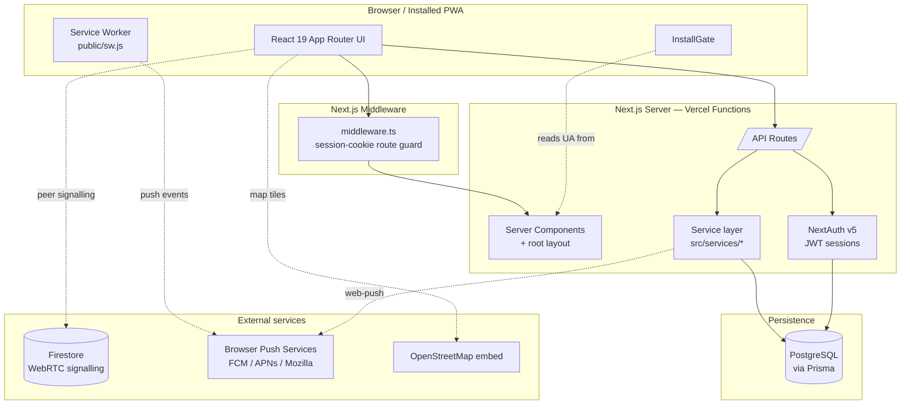
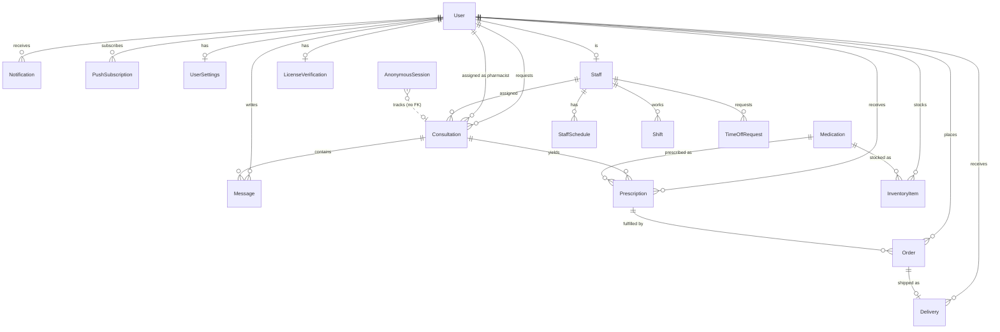
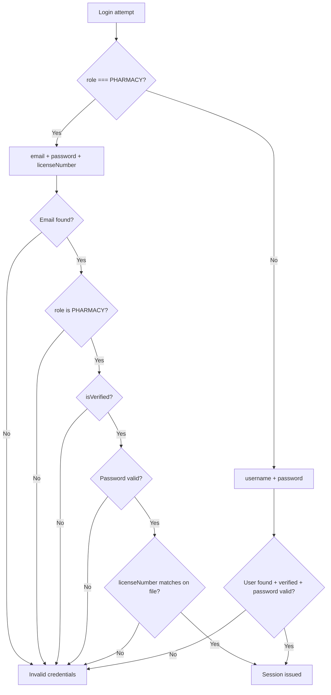
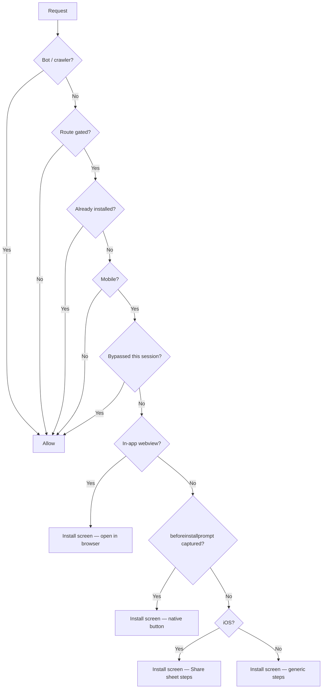

# SafeMeds — Project Documentation

**Anonymous telepharmacy for students.**
Last updated: 2026-08-10 · Reflects `main` @ `7c5eda8`

---

## Table of contents

1. [What SafeMeds is](#1-what-safemeds-is)
2. [Technology stack](#2-technology-stack)
3. [System architecture](#3-system-architecture)
4. [Data model](#4-data-model)
5. [Identity, authentication, and the anonymity model](#5-identity-authentication-and-the-anonymity-model)
6. [Routing and access control](#6-routing-and-access-control)
7. [Backend](#7-backend)
8. [Realtime subsystems](#8-realtime-subsystems)
9. [Frontend architecture](#9-frontend-architecture)
10. [UI design system](#10-ui-design-system)
11. [Animation and motion system](#11-animation-and-motion-system)
12. [The PWA layer](#12-the-pwa-layer)
13. [Testing](#13-testing)
14. [Build and deployment](#14-build-and-deployment)
15. [Known issues and technical debt](#15-known-issues-and-technical-debt)

---

## 1. What SafeMeds is

SafeMeds is a telepharmacy platform built for university students, designed around a
single premise: **a student should be able to get medical advice without anyone —
including SafeMeds — being able to tie that conversation to their name.**

Everything in the architecture follows from that. Consultations can be created with
no account at all. Push notifications refuse to say what they are about. Page HTML
for consultations is deliberately excluded from the browser cache. These are not
incidental choices; they are the product.

The system serves three roles:

| Role | Who | What they do |
|---|---|---|
| `CLIENT` | Students | Request consultations (named or anonymous), chat with pharmacists, order and track prescriptions |
| `PHARMACY` | Licensed pharmacists | Answer consultations, issue prescriptions, manage inventory and staff |
| `ADMIN` | Platform operators | Verify pharmacist licenses, manage users, view analytics and logs |

Geographically, the delivery layer is built around **KNUST (Kumasi, Ghana)** — the
campus drop points in [`src/lib/dropPoints.ts`](../src/lib/dropPoints.ts) carry real
coordinates for the library, student centre, health services building, and main gate.

---

## 2. Technology stack

| Layer | Choice | Notes |
|---|---|---|
| Framework | **Next.js 15.5.9**, App Router | React 19.1, Turbopack in dev |
| Language | **TypeScript 5** | `strict` via `tsconfig.json` |
| Styling | **Tailwind CSS v4** | CSS-first config in `globals.css` (see §10) |
| Database | **PostgreSQL** via **Prisma 6.16** | Client generated to `src/lib/prisma-client` |
| Auth | **NextAuth v5 (beta)** | Credentials provider, JWT sessions |
| Realtime | **Firebase / Firestore** | WebRTC signalling + Remote Config only |
| Animation | **Framer Motion 12** + **OGL** + **Three.js** | 28 files use Framer Motion |
| Icons | **lucide-react** | Tree-shaken via `optimizePackageImports` |
| Push | **web-push** (VAPID) | Node runtime only |
| Validation | **Zod 4** | Used on newer API routes |
| Testing | **Vitest 4** | Node environment, 77 tests |
| Hosting | **Vercel** | `bun install`, 30 s function ceiling |

**Two databases, deliberately.** Postgres is the system of record for everything.
Firebase is used *only* for WebRTC signalling and Remote Config — it holds no
medical data. This split is explained in [`webrtcSignaling.ts`](../src/lib/webrtcSignaling.ts):
there is no standalone WebSocket server, and Firestore's realtime listeners are
sufficient to exchange SDP offers and ICE candidates.

---

## 3. System architecture



### Request lifecycle

1. **Middleware** ([`src/middleware.ts`](../src/middleware.ts)) runs first. It checks
   the path against a public-route allowlist; anything else requires an
   `authjs.session-token` cookie or gets a 302 to `/auth`. It only checks for the
   cookie's *presence* — real validation happens in the NextAuth routes.
2. **Root layout** ([`src/app/layout.tsx`](../src/app/layout.tsx)) reads the
   `user-agent` header, injects the pre-paint PWA script, and wraps the tree in five
   nested providers plus the install gate.
3. **Page** renders. Most pages are `"use client"` and fetch through `/api/*`.
4. **API route** authenticates via `auth()`, validates, calls a service, hits Prisma.

---

## 4. Data model

18 models and 12 enums across five domains. All tables are snake_case via `@@map`.



### Domains

**Identity** — `User`, `UserSettings`, `LicenseVerification`, `AnonymousSession`
**Clinical** — `Consultation`, `Message`, `Prescription`, `Medication`
**Commerce** — `Order`, `Delivery`, `InventoryItem`
**Workforce** — `Staff`, `StaffSchedule`, `Shift`, `TimeOffRequest`
**Comms** — `Notification`, `PushSubscription`, `ContactMessage`

### The nullable-`userId` pattern

The single most important structural decision in the schema. `Consultation`,
`Message`, `Prescription`, `Order`, `Delivery`, and `PushSubscription` **all** carry:

```prisma
userId      String?   // null for anonymous
anonymousId String?   // opaque identifier instead
isAnonymous Boolean   @default(false)
```

An anonymous student therefore produces a complete, fully functional clinical record
with **no foreign key to any person**. This is what makes the anonymity real rather
than cosmetic — there is no join that recovers the identity, because the identity was
never written.

### Enums

`UserRole` · `ConsultationStatus` · `MessageType` · `NotificationType` ·
`DeliveryStatus` (7 states) · `PrescriptionStatus` · `OrderStatus` (7 states) ·
`PaymentStatus` · `StaffPosition` · `ShiftStatus` · `TimeOffType` · `TimeOffStatus`

### Live GPS on `Delivery`

`Delivery` carries courier telemetry directly: `courierLat`, `courierLng`,
`courierAccuracy`, `courierHeading`, `courierSpeed`, `courierActive`,
`courierUpdatedAt`. See §8.

---

## 5. Identity, authentication, and the anonymity model

### Three authentication paths

[`src/app/auth.ts`](../src/app/auth.ts) defines one Credentials provider that branches
on the submitted `role`:



Two details worth calling out:

- **Every failure returns the identical string, `"Invalid credentials"`.** Nothing
  distinguishes an unknown email from a wrong password from an unverified account.
  This is deliberate anti-enumeration.
- **A license-number mismatch fails the login and does not self-heal.** The comment
  in `auth.ts:96-100` is explicit: changing a verified credential must go through the
  admin verification flow, never a login attempt.

Sessions are **JWT**, 24-hour `maxAge`, with `id`/`username`/`role` propagated through
the `jwt` and `session` callbacks. Passwords are bcrypt-hashed
([`src/utils/password.ts`](../src/utils/password.ts)).

### The anonymous path

No account required. `POST /api/consultations/anonymous` creates two rows:

```
Consultation { isAnonymous: true, anonymousId, userId: null }
AnonymousSession { sessionId, consultationId, expiresAt: +7 days }
```

The student is handed the **`sessionId`** as their only claim ticket. `anonymousId`
and `sessionId` are **different values** — the consultation carries `anonymousId`,
while `AnonymousSession` is keyed on `sessionId` and points back via `consultationId`.
Confusing the two is an easy bug; the push layer navigates the link explicitly in
`notifyConsultationReply()`.

The flow ends at `/track?sessionId=…`, and the session self-expires after 7 days.

---

## 6. Routing and access control

**Three independent layers**, in execution order:

| Layer | File | Enforces | Bypassable? |
|---|---|---|---|
| 1. Middleware | `src/middleware.ts` | Session cookie present | No — server-side |
| 2. `useAuth` hook | `src/hooks/useAuth.ts` | Client redirect | Yes — client-side |
| 3. `ProtectedRoute` | `src/components/Auth/ProtectedRoute.tsx` | Role-based gating | Yes — client-side |

Only layer 1 is a genuine security boundary. Layers 2 and 3 are UX.

**Public routes** (middleware allowlist): `/`, `/auth`, `/signin`, `/signup`,
`/verify`, `/about`, `/contact`, `/search`, `/legal`, `/consult`, `/track`,
`/delivery`, `/offline`.

The middleware matcher excludes `api`, `_next/static`, `_next/image`, `favicon.ico`,
and **any path containing a dot** — which is what lets `/sw.js`,
`/manifest.webmanifest`, and `/icons/*.png` through untouched.

### Route inventory

**44 pages.** Public marketing (`/`, `/about`, `/contact`, `/legal`, `/search`);
auth (`/auth`, `/signin`, `/signup`, `/signout`, `/verify-license`); student
(`/client-dashboard`, `/consult`, `/consultations`, `/track`, `/orders`, `/medications`,
`/inbox`, `/chat`, `/settings`); pharmacy (`/pharmacy-dashboard`, `/inventory/add`,
`/staff-management`, `/deliver/[deliveryId]`); admin (`/admin` + 12 sub-pages);
system (`/offline`).

**31 API routes**, covering auth, consultations, chat, orders, prescriptions,
medications, inventory, delivery, staff, analytics, notifications, contact, admin,
and push.

---

## 7. Backend

### Layering

```
API route  →  validate (Zod)  →  auth()  →  service  →  Prisma  →  Postgres
```

Adherence is **inconsistent** — newer routes (push, staff) validate with Zod and
delegate to services; older ones call Prisma directly inside the handler.

### The service layer

`src/services/` holds server-side domain logic: `push.ts`, `consultationService.ts`,
`orderService.ts`, `medicationService.ts`, `staffService.ts`, `licenseService.ts`,
`settingsService.ts`, `analyticsService.ts`.

`src/lib/` holds mixed client/server helpers: `prisma.ts`, `notifications.ts`,
`rateLimit.ts`, `dropPoints.ts`, `locationTracking.ts`, `webrtcSignaling.ts`,
`firebase.ts`, `legal.ts`, plus client-side `chatService.ts`, `messageService.ts`,
`deliveryService.ts`, `consultationService.ts`.

> ⚠️ `src/lib/consultationService.ts` and `src/services/consultationService.ts` both
> exist, both 248 lines, with overlapping type names and different shapes. See §15.

### Prisma client construction

[`src/lib/prisma.ts`](../src/lib/prisma.ts) does something subtle and correct: it
inspects the `DATABASE_URL` **protocol at runtime** and only applies the Accelerate
extension for `prisma://` / `prisma+postgres://` URLs. Direct `postgresql://` URLs use
the bundled query engine. This lets the same code run against a local Postgres and a
Vercel Accelerate connection without a build flag.

A `globalThis` singleton prevents connection exhaustion under dev hot-reload.

### Rate limiting

[`src/lib/rateLimit.ts`](../src/lib/rateLimit.ts) is an **in-memory `Map`** with a
fixed window. On serverless this is per-instance and resets on cold start — it slows
casual abuse but is not a real distributed limiter.

---

## 8. Realtime subsystems

### Video consultations (WebRTC over Firestore)

```
videoRooms/{roomId}                        → { offer, answer }
videoRooms/{roomId}/callerCandidates/{id}  → ICE from the student
videoRooms/{roomId}/calleeCandidates/{id}  → ICE from the pharmacist
```

Firestore carries only signalling; media is peer-to-peer and never transits SafeMeds
servers. The file notes honestly that the **pharmacist-side client does not exist
yet** — `createCall` will simply never receive an answer, and the UI must time out
rather than hang.

### Delivery GPS tracking

Notably, this does **not** use Firebase. It runs over the app's own Postgres API:

```
POST /api/delivery/[id]/location   ← courier publishes a fix
GET  /api/delivery/[id]/location   ← student polls every 3000 ms
```

The courier opens `/deliver/[deliveryId]` on a phone, which streams
`navigator.geolocation` fixes. The student's page polls and renders position on an
**OpenStreetMap embed** — no Google Maps key, no billing account. ETA is computed
against the campus drop points in `dropPoints.ts`.

---

## 9. Frontend architecture

### Provider tree

From [`src/app/layout.tsx`](../src/app/layout.tsx):

```
<html>
  <head> ← pre-paint PWA script
  <body>
    ThemeProvider              ← light/dark, localStorage
      SessionProvider          ← NextAuth session
        NotificationProvider   ← in-app notification bell state
          OnboardingProvider   ← first-run wizard
            NavButtons
            ThemeToggle        ← fixed bottom-right, every page
            InstallGate        ← wraps children
              {children}
            ServiceWorkerRegistrar
            OnboardingWizard
```

### State management

No Redux, Zustand, or React Query. State is:

- **React Context** for cross-cutting concerns (4 providers above)
- **Local `useState`** for everything else
- **`fetch` in `useEffect`** for server data, with manual `loading`/`error` flags

The consequence is no request deduplication, no caching, and no background
revalidation. It is simple and it works, but data fetching is repetitive across pages.

### Client-heavy rendering

Most pages open with `"use client"`, including the landing page. Server Components are
used mainly for the root layout and `/offline`. Combined with `headers()` in the root
layout (§12), **every route is dynamically rendered**.

---

## 10. UI design system

### Theming

Tailwind v4 with **CSS-first configuration** in
[`globals.css`](../src/app/globals.css). Dark mode is redefined to follow a `.dark`
class rather than `prefers-color-scheme`:

```css
@custom-variant dark (&:where(.dark, .dark *));
```

`ThemeContext` toggles that class on `<html>` and persists to `localStorage`. Because
it resolves in `useEffect`, there is a brief light-then-dark flash on load. (The PWA
gate deliberately avoids this pattern — see §12.)

Only two design tokens exist: `--background` and `--foreground`. Everything else uses
Tailwind's stock palette directly — predominantly `blue-600` → `purple-600` gradients,
with `gray-50…900` for surfaces.

### Recurring visual patterns

- **Gradient page shell** — `bg-gradient-to-br from-blue-50 via-purple-50 to-pink-50`, dark: `from-gray-900 via-gray-800 to-gray-900`
- **Glass navigation** — `bg-white/80 backdrop-blur-md` with a hairline border
- **Gradient headline text** — `text-transparent bg-clip-text bg-gradient-to-r`
- **Card** — `rounded-xl` / `rounded-2xl`, subtle border, hover elevation
- **Primary action** — `bg-blue-600 hover:bg-blue-700 rounded-xl font-semibold`

### Spotlight cards

`.rb-spotlight` (globals.css) implements a cursor-tracking radial glow. The mouse
position is written to CSS custom properties via `onMouseMove` **rather than React
state**, so the glow never triggers a re-render — a deliberate performance choice,
documented inline.

---

## 11. Animation and motion system

Four distinct tiers, ordered by cost.

### Tier 1 — Framer Motion (28 files)

The workhorse. Standard vocabulary across the app:

```tsx
initial={{ opacity: 0, y: 20 }}
animate={{ opacity: 1, y: 0 }}
transition={{ duration: 0.8, delay: 0.15 }}
```

`AnimatePresence` drives mobile-menu collapse, the onboarding wizard, the push
permission prompt, and modal exits. Staggering is done with incremental `delay` values
rather than variants.

### Tier 2 — CSS keyframes

The **testimonial marquee** in `globals.css` is the notable one. The track renders the
list twice back-to-back and translates exactly `-50%` — one full copy's width — so the
loop point is seamless regardless of card count. It pauses on hover and is disabled
entirely under `prefers-reduced-motion`.

### Tier 3 — Canvas 2D

**`ClickSpark`** — radial spark burst on click. Plain canvas, no WebGL, negligible
cost. Wraps interactive regions.

### Tier 4 — WebGL shader backgrounds

Four effects, adapted from [React Bits](https://reactbits.dev):

| Effect | Renderer | What it does | Used on |
|---|---|---|---|
| **LiquidEther** | Three.js | Navier–Stokes fluid simulation driven by pointer velocity | Landing hero |
| **LightTunnel** | OGL | Fibre-optic tunnel with pulses travelling along cables | Landing CTA |
| **Threads** | OGL | Perlin-noise line threads | Auth / signup |
| **WebThreads** | OGL | Woven glowing strands, mouse-reactive pinch point | Landing navbar |

Every one of these follows the same three-part discipline:

**1. A `*Background` wrapper that gates on motion preference.**
`LiquidEtherBackground`, `LightTunnelBackground`, `ThreadsBackground`, and
`WebThreadsBackground` are near-identical: they check
`prefers-reduced-motion`, return `null` if set, and `next/dynamic({ ssr: false })` the
heavy component so **it never enters the initial page bundle**.

**2. Lifecycle guards inside the effect.** Each uses an `IntersectionObserver` plus a
`visibilitychange` listener, and cancels its `requestAnimationFrame` loop whenever the
canvas is off-screen or the tab is hidden. No effect burns GPU for something nobody
can see.

**3. Explicit teardown.** Observers disconnected, listeners removed, canvas removed,
and `WEBGL_lose_context` called to release the GPU context.

`Threads.tsx` adds one more optimisation worth noting: because its fragment shader
runs per-pixel Perlin noise across 40 lines, it **caps internal render resolution at
1920px on the longest side**, scaling DPR down on large or high-DPI displays. The
effect is soft enough that the downscale is invisible.

Props are mutated through a `propsRef` so changing a colour updates live shader
uniforms instead of tearing down and rebuilding the WebGL context.

### Tier 5 — Video

A looping, muted, `playsInline` clip sits behind the landing hero, docked right at
`w-1/2 md:w-2/5`, faded in with a `linear-gradient` mask so the headline stays legible.

---

## 12. The PWA layer

Full design rationale lives in
[`2026-08-09-pwa-install-gate-design.md`](superpowers/specs/2026-08-09-pwa-install-gate-design.md).

### Why it exists

On iOS an installed PWA gets **its own cookie jar, separate from Safari**. A student
who signs in in Safari is signed *out* inside the installed app. Gating the entry
points means the session is created where the student will actually keep using it. It
is also what makes iOS web push possible at all (iOS 16.4+ requires an installed PWA).

### Gate decision logic

Extracted as a **pure function**
([`resolve-gate-state.ts`](../src/lib/pwa/resolve-gate-state.ts)) so it is testable
without a DOM. First match wins:



Four rules carry real weight:

- **Bots are never gated.** Googlebot crawls with a *smartphone* user agent. Without
  this rule, `/consult` and `/signup` would drop out of search entirely.
- **In-app webviews get different copy.** Instagram/WhatsApp/Facebook browsers
  physically cannot install a PWA; showing them "Add to Home Screen" is a dead end.
- **Everything uncertain fails open.** Any detection error renders the page. Trapping
  a student out of a consultation is worse than letting them use the mobile site.
- **The gate is not a security boundary.** Gated content is present in the DOM
  underneath the overlay, by design.

### No-flash rendering

The user agent is read **server-side**, so the overlay ships in the initial HTML. A
small synchronous script in `<head>` stamps `data-display-mode` and `data-pwa-bypass`
on `<html>` before first paint, and CSS in `globals.css` hides the overlay for people
who already installed or dismissed it. Neither audience ever sees a flash.

### Service worker caching

Hand-written ([`public/sw.js`](../public/sw.js)) — runtime caching avoids precaching
Next's content-hashed filenames, so there is no build coupling.

| Request | Strategy |
|---|---|
| `/_next/static/*`, fonts | Cache-first (immutable) |
| Icons, images | Stale-while-revalidate |
| `/offline`, icons | Precached on install |
| Public page navigations | Network-first → `/offline` |
| **`/api/*`** | **Network-only, never stored** |
| **Gated-route HTML** | **Network-first, never written to cache** |

> The last two rows are load-bearing. A naive network-first worker stores every
> response, which would leave consultation and dashboard markup readable on the device
> **after sign-out**. Verified empirically: after browsing `/consult`, `/about`, and an
> API route, Cache Storage held only `/offline`, icons, and CSS.

### Push notifications

**Payloads carry no medical content.** Notifications render on a *locked* screen, so
the wire payload is a strict three-key whitelist — `{ kind, link, tag }` — and the
service worker renders fixed generic copy: *"SafeMeds · You have a new message"*.

`buildPushPayload()` destructures explicitly rather than spreading, so a caller cannot
accidentally leak a symptom or medication field. A dedicated test asserts that
symptoms, medication names, and patient names never survive serialisation.

`link` is sanitised to same-origin relative paths only — a notification tap calls
`openWindow()`, so an absolute URL would be an open redirect fired from a lock screen.

`PushSubscription.userId` is nullable so anonymous consultations still receive
replies, routed through `AnonymousSession`.

---

## 13. Testing

**Vitest 4**, `environment: "node"`, matching `src/**/*.test.ts`. **77 tests, 8 files.**

| File | Covers |
|---|---|
| `password.test.ts` | bcrypt hashing / verification |
| `legal.test.ts` | Legal document helpers |
| `license.test.ts` | License verification rules |
| `settings.test.ts` | Settings service |
| `pwa-environment.test.ts` | UA classification — iOS, Android, Instagram, Googlebot, iPadOS, desktop |
| `pwa-gated-routes.test.ts` | Route matching, incl. `/consultations` ≠ `/consult` |
| `pwa-resolve-gate-state.test.ts` | All 8 gate branches + fail-open |
| `pwa-push-payload.test.ts` | Privacy guard + link sanitisation |

There is **no jsdom and no React Testing Library**, so no component renders under
test. The PWA logic was deliberately written as pure functions to stay testable within
that constraint.

---

## 14. Build and deployment

```jsonc
// vercel.json
{
  "buildCommand": "prisma generate && next build",
  "installCommand": "bun install",
  "framework": "nextjs",
  "functions": { "src/app/api/**/*.ts": { "maxDuration": 30 } }
}
```

| Script | Purpose |
|---|---|
| `npm run dev` | Next dev with Turbopack |
| `npm run build` | `prisma generate && next build` |
| `npm run build:no-db` | `next build` only — use when a dev server holds the Prisma engine DLL |
| `npm test` | Vitest watch |
| `npm run db:migrate` / `db:push` / `db:seed` / `db:studio` | Prisma workflows |
| `node scripts/generate-icons.mjs` | Regenerate PWA icons from the brand mark |

**Required environment:** `DATABASE_URL`, `NEXTAUTH_SECRET`,
`NEXT_PUBLIC_FIREBASE_*`, and — for push — `VAPID_PUBLIC_KEY`, `VAPID_PRIVATE_KEY`,
`VAPID_SUBJECT`, `NEXT_PUBLIC_VAPID_PUBLIC_KEY`.

`next.config.ts` sets `turbopack.root`, tree-shakes `lucide-react` and
`framer-motion`, and serves `/sw.js` with `Cache-Control: max-age=0, must-revalidate`
plus `Service-Worker-Allowed: /`.

---

## 15. Known issues and technical debt

Findings from reading the current tree. Ordered by how much they would bite.

### 1. Push notifications are inert

Three steps outstanding: generate VAPID keys, run
`npx prisma migrate dev --name add_push_subscriptions` (the `PushSubscription` model
is in `schema.prisma` but **has no migration** — the four on disk predate it), and
mount `<PushPermissionPrompt />` in the consult chat. Until then `/api/push/subscribe`
returns 503 by design.

### 2. `tailwind.config.js` is dead configuration

The project uses **Tailwind v4**, which is CSS-first. `globals.css` has
`@import "tailwindcss"` but **no `@config` directive**, so the JS config is never
loaded. Its `safe-blue` / `safe-green` / `safe-orange` palettes and `fade-in` /
`slide-up` animations have **zero usages** in the codebase. It also references
`--font-geist-sans`, a font the project no longer uses. Either wire it up with
`@config` or delete it — right now it misleads anyone who reads it.

### 3. `useAuth` redirects too aggressively

The `useEffect` in [`useAuth.ts:47-54`](../src/hooks/useAuth.ts) pushes any
unauthenticated visitor to `/auth` from *every* page except `/auth`, `/signup`, and
`/`. Any public page that calls the hook — `/about`, `/contact`, `/legal` — bounces
logged-out visitors to sign-in even though middleware treats those routes as public.
This is observable and contradicts the middleware allowlist.

### 4. Duplicate consultation services

`src/lib/consultationService.ts` and `src/services/consultationService.ts` are both
248 lines with overlapping type names (`Consultation`, `CreateConsultationData`) and
different shapes. Unclear which is authoritative.

### 5. Every route is dynamically rendered

`headers()` in the root layout opts the whole app out of static generation. This is
the deliberate cost of a flash-free install gate, but `/about`, `/contact`, and
`/legal` could otherwise be static. Reversible by moving UA detection client-side and
hiding content pre-paint instead.

### 6. Rate limiting does not survive serverless

The in-memory `Map` in `rateLimit.ts` is per-instance and resets on cold start.
Adequate against casual abuse, ineffective against a determined one.

### 7. Video consultation is half-built

`webrtcSignaling.ts` implements the student side; the pharmacist client that would
answer the offer does not exist. The file says so plainly.

### 8. Inconsistent API discipline

Newer routes validate with Zod and delegate to services. Older ones call Prisma
inline with ad-hoc validation. Worth converging.

### 9. iOS install flow is unverified

The Add-to-Home-Screen path cannot be emulated. Every other branch — Android UA,
Instagram webview, Googlebot, desktop, escape hatch, SW registration, cache
contents — has been confirmed directly. This one needs one pass on real hardware.
